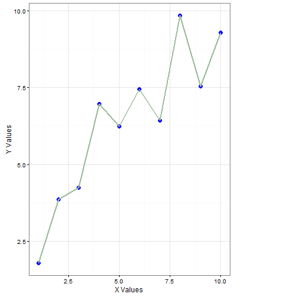
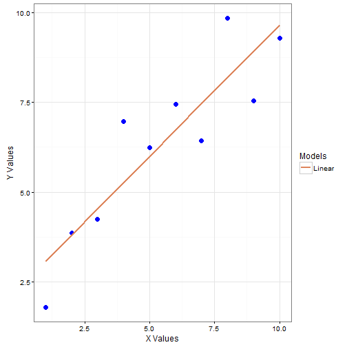
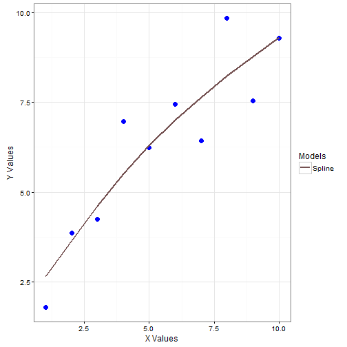
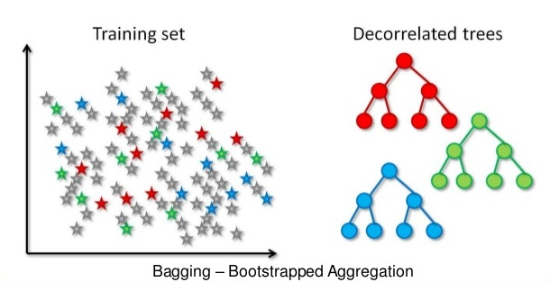

## Agenda

1. Understanding Bias and Variance
2. Tree models: Bias Variance
3. RandomForest algorithm
4. RandomForest: Parameter tuning

---

## Bias and Variance

---

## Bias and Variance

---

## Bias and Variance

---
## Bias and Variance

---

## Bias and Variance

---

## Bias and Variance

* Lets change the data

---
## Bias and Variance

* If the flexibility decreases the variance decreases (new data doesn't change the error much)
* If the flexibility decreases then the bias increases (subtelities in the data can't be captured)

---
## Bias and Variance

* If the flexibility decreases the variance decreases (new data doesn't change the error much)
* If the flexibility decreases then the bias increases (subtelities in the data can't be captured)

###### ISL,James, Witten, Hastie & Tibshirani,Ch-2,pp-25

---

## Tree models: Bias and variance

* We've seen that Bias and Variance can't be minimized simultaneously.(Or can they be!!!!)
* If we have low bias, then the variance will be high
* For a decision tree model, out of variance and bias which one is easier to minimize?
* Hint: Image below:

---

## Tree models: Bias and variance

* Usually the variance in a tree model is controlled by pruning the tree
* What if we don't want to prune the tree and still reduce the variance?

* Hint: One of the things that causes variance in the models is ever changing "data"
* Is there a mechanism by which we expose our model to the **variety** in data and still maintain the flexibility of model(Still have trees with large depths and hence small bias)?

---
## Tree models: Bias and variance

* Bagging is one of the ways to accomplish this

* Build a lots of trees from the bootstrapped sample of data and let this group of trees (Garden of Trees!!!) decide (by majority vote)

* What is bootstrapped sampling?

---

##  Tree models: Bias and variance

* Fancy name for sampling with replacement

---

## Tree models: Bias and variance

* Bagging overview:

* Now we have a way of keeping the bias low and also lowering the variance
* Can we improve this any further?

---

## RandomForest: Algorithm

* Till now we've been able to introduce randomization at the level of sampling, is there a scope for improving this further?
* Would it be a good idea to randomly choose the features also along with taking the bootstrapped samples.

---

## RandomForest: Algorithm

1. Sample N cases at random with replacement to create a subset of the data (see top layer of figure above). The subset should be about 66% of the total set.

2. At each node: 

* For some number m, (m<<sqrt(Total Features): for classification problems and m<1/3(Total Features): for regression problems) m features are selected at random from all the predictor variables.

* The predictor variable that provides the best split, according to some objective function, is used to do a binary split on that node.

* At the next node, choose another m variables at random from all predictor variables and do the same

3. Prediction is done by majority vote (for classification problems) and finding the mean response across models in a regression setting

---

## RandomForest: Tuning the parameters

* While building a RandomForestmodel what choices do we have in terms of parameters?(Is there just once recipie to build a RandomForest?)

* Forests will differ based on what choices we make for: Number of Trees, Number of features used for a split, Nodesize, Maximum number of nodes

---

## RandomForest: Tuning the parameters

* The problem now is how to choose these parameters
* The principle will be: Choose to reduce out of sample error
* For random forest we choose to optimize "out of bag error"
